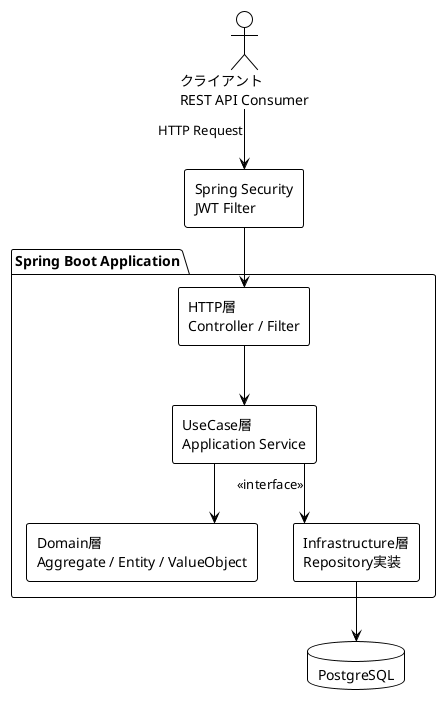
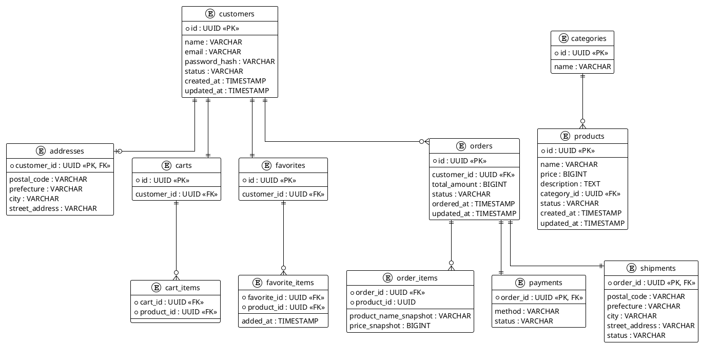
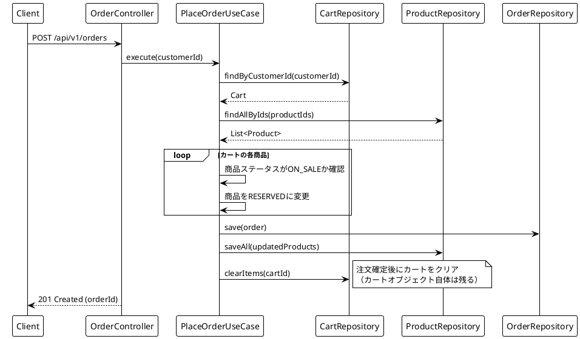
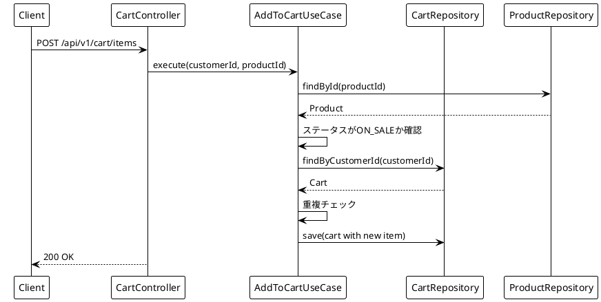

# 機能設計書 (Functional Design Document)

## システム構成図



**依存の方向**: HTTP → UseCase → Domain ← Infrastructure（DIによる依存逆転）

---

## 技術スタック

| 分類 | 技術 | 選定理由 |
|------|------|----------|
| 言語 | Kotlin 1.9 | data class / sealed class がDDDの値オブジェクト・ドメインイベント表現に最適 |
| フレームワーク | Spring Boot 3 | KotlinのデファクトスタンダードBE。認証・DB連携・DI を網羅 |
| DB | PostgreSQL 16 | MySQLとの差分学習。JSON型・高度なインデックス機能が利用可能 |
| ORM | Exposed | JetBrains製Kotlin DSL。型安全なSQL記述でJPAのインピーダンスミスマッチを回避 |
| マイグレーション | Flyway | SQLベースのスキーマバージョン管理 |
| 認証 | Spring Security + JWT | ステートレスなREST API認証 |
| ドキュメント | SpringDoc OpenAPI | コードからSwagger UIを自動生成 |
| テスト | JUnit 5 + TestContainers | ドメイン単体テスト + 実DBを使った統合テスト |
| 開発環境 | devcontainer (Docker) | 環境差異をゼロにする |

---

## 境界付けられたコンテキストと集約

ドメインモデルは5つの境界付けられたコンテキストに分割する。

| コンテキスト | 集約ルート | 主な責務 |
|---|---|---|
| 顧客コンテキスト | Customer, Favorite | 顧客情報・認証・お気に入り管理 |
| カタログコンテキスト | Product | 商品の登録・公開・ステータス管理 |
| 注文コンテキスト | Cart, Order | カート操作・注文確定・注文履歴 |
| 決済コンテキスト | Payment（モック） | 決済状態の記録（外部連携なし） |
| 配送コンテキスト | Shipment（モック） | 配送状態の記録（外部連携なし） |

コンテキスト間は**IDによる参照のみ**（直接オブジェクト参照なし）。

---

## データモデル定義

### 顧客 (Customer) ※集約ルート

```kotlin
data class CustomerId(val value: UUID)

data class Customer(
    val id: CustomerId,
    val name: CustomerName,              // 値オブジェクト、1-50文字
    val email: Email,                    // 値オブジェクト、システム全体でユニーク
    val passwordHash: String,            // BCryptハッシュ
    val status: CustomerStatus,          // 活性 | 非活性
    val address: Address?                // 値オブジェクト（任意）
    // createdAt/updatedAt は監査情報のためInfrastructure層で管理
)

enum class CustomerStatus { ACTIVE, INACTIVE }

data class Email(val value: String)      // フォーマット検証済み

data class Address(                      // 値オブジェクト（不変）
    val postalCode: String,              // 例: "123-4567"
    val prefecture: String,
    val city: String,
    val streetAddress: String
)
```

**ビジネスルール**:
- メールアドレスはシステム全体でユニーク
- `ACTIVE` の顧客のみ注文・カート操作が可能
- パスワードは8文字以上、英数字混在必須

---

### お気に入りリスト (Favorite) ※集約ルート

```kotlin
data class FavoriteId(val value: UUID)

data class Favorite(
    val id: FavoriteId,
    val customerId: CustomerId,          // 1顧客につき1リスト
    val items: List<FavoriteItem>
)

data class FavoriteItem(
    val productId: ProductId,
    val addedAt: Instant
)
```

**ビジネスルール**:
- 同じ商品の重複追加不可
- 追加できる商品ステータス: `ON_SALE`（販売中）または `RESERVED`（売約済み）のみ
- `SOLD`（売却済み）・`PRIVATE`（非公開）の商品は追加不可

---

### 商品 (Product) ※集約ルート

```kotlin
data class ProductId(val value: UUID)

data class Product(
    val id: ProductId,
    val name: String,                    // 1-100文字
    val price: Money,                    // 値オブジェクト（0より大きい）
    val description: String,             // 最大2000文字
    val categoryId: CategoryId,
    val status: ProductStatus
    // createdAt/updatedAt は監査情報のためInfrastructure層で管理
)

enum class ProductStatus {
    ON_SALE,    // 販売中
    RESERVED,   // 売約済み（注文確定後）
    SOLD,       // 売却済み（配送完了後）
    PRIVATE     // 非公開
}

data class Money(val amount: Long)       // 円単位、0より大きい

data class CategoryId(val value: UUID)

data class Category(
    val id: CategoryId,
    val name: String
)
```

**ビジネスルール**:
- 価格は1円以上
- `ON_SALE` の商品のみカートに追加可能
- 1点もの（在庫管理の概念なし）

---

### カート (Cart) ※集約ルート

```kotlin
data class CartId(val value: UUID)

data class Cart(
    val id: CartId,
    val customerId: CustomerId,          // 1顧客につき1カート
    val items: List<CartItem>
)

data class CartItem(
    val productId: ProductId,
    val addedAt: Instant
)
```

**ビジネスルール**:
- 同じ商品の重複追加不可
- `ON_SALE` の商品のみ追加可能
- カートは1顧客につき1つ（注文確定後もカートは残る）

---

### 注文 (Order) ※集約ルート

```kotlin
data class OrderId(val value: UUID)

data class Order(
    val id: OrderId,
    val customerId: CustomerId,
    val items: List<OrderItem>,          // 1件以上必須
    val totalAmount: Money,
    val status: OrderStatus,
    val payment: Payment,
    val shipment: Shipment,
    val orderedAt: Instant               // 注文日時（注文履歴表示に必要なドメイン概念）
    // updatedAt は監査情報のためInfrastructure層で管理
)

enum class OrderStatus {
    CONFIRMED,  // 確定
    SHIPPING,   // 配送中
    DELIVERED,  // 配送完了
    CANCELLED   // キャンセル
}

data class OrderItem(
    val productId: ProductId,
    val productNameSnapshot: String,     // 注文時の商品名スナップショット
    val priceSnapshot: Money             // 注文時の価格スナップショット
)

data class Payment(
    val method: PaymentMethod,
    val status: PaymentStatus
)

enum class PaymentMethod { CREDIT_CARD, BANK_TRANSFER }
enum class PaymentStatus { UNPAID, PAID }

data class Shipment(
    val address: Address,                // 配送先住所スナップショット
    val status: ShipmentStatus
)

enum class ShipmentStatus { NOT_SHIPPED, SHIPPED, DELIVERED }
```

**ビジネスルール**:
- 注文確定時に商品を `RESERVED` に変更（既に `RESERVED` の場合はエラー）
- 注文確定時に `CONFIRMED` ステータスで作成される
- 注文確定後は内容変更不可
- `SHIPPING` / `DELIVERED` 後はキャンセル不可
- 決済ステータスが `PAID` にならないと配送ステータスを `SHIPPED` に進められない
- 配送完了（`DELIVERED`）時に商品ステータスを `SOLD` に変更

---

## ER図



---

## API設計

### 認証

#### 会員登録
```
POST /api/v1/auth/register
```
リクエスト:
```json
{
  "name": "田中太郎",
  "email": "tanaka@example.com",
  "password": "Pass1234!"
}
```
レスポンス `201 Created`:
```json
{ "customerId": "uuid" }
```
エラー: `400` バリデーションエラー / `409` メールアドレス重複

---

#### ログイン
```
POST /api/v1/auth/login
```
リクエスト:
```json
{
  "email": "tanaka@example.com",
  "password": "Pass1234!"
}
```
レスポンス `200 OK`:
```json
{ "accessToken": "jwt_token", "expiresIn": 3600 }
```
エラー: `401` 認証失敗

---

### 顧客 (Customer)

| メソッド | パス | 説明 | 認証 |
|---|---|---|---|
| GET | `/api/v1/customers/me` | 自分のプロフィール取得 | 必要 |
| PUT | `/api/v1/customers/me/address` | 配送先住所の登録・更新 | 必要 |

---

### 商品 (Product)

| メソッド | パス | 説明 | 認証 |
|---|---|---|---|
| GET | `/api/v1/products` | 商品一覧（`ON_SALE`のみ、カテゴリ絞り込み・ページネーション対応） | 不要 |
| GET | `/api/v1/products/{productId}` | 商品詳細（`ON_SALE`のみ） | 不要 |
| GET | `/api/v1/products/{productId}/management` | 商品詳細管理用（全ステータス対応） | 必要 |
| POST | `/api/v1/products` | 商品登録（出品者） | 必要 |
| PUT | `/api/v1/products/{productId}` | 商品情報更新 | 必要 |
| PATCH | `/api/v1/products/{productId}/status` | 商品ステータス変更 | 必要 |

`POST /api/v1/products` リクエスト例:
```json
{
  "name": "ヴィンテージデニムジャケット",
  "price": 8500,
  "description": "1990年代のデニムジャケット。状態良好。",
  "categoryId": "uuid"
}
```
レスポンス `201 Created`:
```json
{ "productId": "uuid" }
```

`PUT /api/v1/products/{productId}` リクエスト例:
```json
{
  "name": "ヴィンテージデニムジャケット（値下げ）",
  "price": 7000,
  "description": "1990年代のデニムジャケット。状態良好。値下げしました。",
  "categoryId": "uuid"
}
```
レスポンス `200 OK`: 更新後の商品情報

`PATCH /api/v1/products/{productId}/status` リクエスト例:
```json
{ "status": "ON_SALE" }
```
レスポンス `200 OK`: 更新後の商品情報
エラー: `409` 許可されていないステータス遷移

商品一覧クエリパラメータ:
- `categoryId`: カテゴリIDで絞り込み
- `page`: ページ番号（0始まり）
- `size`: 1ページのサイズ（デフォルト20）

---

### カート (Cart)

| メソッド | パス | 説明 | 認証 |
|---|---|---|---|
| GET | `/api/v1/cart` | カート内容取得 | 必要 |
| POST | `/api/v1/cart/items` | 商品をカートに追加 | 必要 |
| DELETE | `/api/v1/cart/items/{productId}` | カートから商品を削除 | 必要 |

`GET /api/v1/cart` レスポンス例:
```json
{
  "cartId": "uuid",
  "items": [
    {
      "productId": "uuid",
      "productName": "商品A",
      "price": 3000,
      "status": "ON_SALE"
    }
  ],
  "totalAmount": 3000
}
```
**合計金額の計算方法**: カート取得時に商品テーブルをJOINし、各商品の現在価格を取得して合計する（カートには価格スナップショットを持たない）。

---

### お気に入り (Favorite)

| メソッド | パス | 説明 | 認証 |
|---|---|---|---|
| GET | `/api/v1/favorites` | お気に入り一覧取得 | 必要 |
| POST | `/api/v1/favorites/items` | お気に入りに追加 | 必要 |
| DELETE | `/api/v1/favorites/items/{productId}` | お気に入りから削除 | 必要 |

---

### 注文 (Order)

| メソッド | パス | 説明 | 認証 |
|---|---|---|---|
| POST | `/api/v1/orders` | 注文確定（カートから注文作成） | 必要 |
| GET | `/api/v1/orders` | 自分の注文履歴一覧 | 必要 |
| GET | `/api/v1/orders/{orderId}` | 注文詳細 | 必要 |
| PATCH | `/api/v1/orders/{orderId}/cancel` | 注文キャンセル | 必要 |
| PATCH | `/api/v1/orders/{orderId}/payment` | 決済ステータス更新（モック） | 必要 |
| PATCH | `/api/v1/orders/{orderId}/shipment` | 配送ステータス更新（モック） | 必要 |

---

### 共通エラーレスポンス形式

```json
{
  "code": "PRODUCT_NOT_FOUND",
  "message": "商品が見つかりません",
  "details": {}
}
```

| HTTPステータス | 用途 |
|---|---|
| 400 | バリデーションエラー |
| 401 | 未認証 |
| 403 | 認可エラー（他人のリソースへのアクセス） |
| 404 | リソースが見つからない |
| 409 | ビジネスルール違反（重複・ステータス不正など） |
| 500 | サーバー内部エラー |

---

## ユースケースフロー

### 注文確定フロー

注文確定処理は `@Transactional` により1トランザクション内で実行する。いずれかのステップで失敗した場合、全ての変更がロールバックされる。



### 商品カート追加フロー



---

## コンポーネント設計

### HTTP層の責務

- リクエストのデシリアライズ・バリデーション（`@Valid`）
- JWTから`customerId`を取得し、UseCaseに渡す
- UseCaseの結果をレスポンスDTOに変換してシリアライズ
- 例外をHTTPステータスにマッピング（`@ExceptionHandler`）

### UseCase層の責務

- 1ユースケース = 1クラス（単一責任の原則）
- トランザクション境界の管理（`@Transactional`）
- ドメインオブジェクトの取得・操作・永続化の調整
- ドメインの型のみを扱う（DTOは持ち込まない）

### Domain層の責務

- 集約・値オブジェクト・ドメインサービスの実装
- ビジネスルールの完全な表現（ドメイン層以外にビジネスロジックを持ち込まない）
- Repositoryインターフェースの定義
- インフラ層・フレームワークに一切依存しない

### Infrastructure層の責務

- Repositoryインターフェースの実装（Exposed DSLを使用）
- ドメインモデル ↔ DBテーブルの変換（マッパー）
- Flyway マイグレーションスクリプトの管理

---

## エラーハンドリング

### ドメイン例外の分類

| 例外クラス | HTTPステータス | 用途 |
|---|---|---|
| `DomainValidationException` | 400 | 値オブジェクトのバリデーション違反 |
| `BusinessRuleViolationException` | 409 | ビジネスルール違反（重複追加・ステータス不正） |
| `ResourceNotFoundException` | 404 | 集約が見つからない |
| `UnauthorizedAccessException` | 403 | 他人のリソースへのアクセス |

### 具体的なエラーコード例

| コード | 意味 |
|---|---|
| `PRODUCT_NOT_FOUND` | 商品が存在しない |
| `PRODUCT_NOT_ON_SALE` | 販売中でない商品をカート追加しようとした |
| `CART_ITEM_ALREADY_EXISTS` | カートに同じ商品が既に存在する |
| `ORDER_ALREADY_RESERVED` | 注文確定時に既に売約済みだった |
| `ORDER_CANNOT_CANCEL` | キャンセルできない状態の注文をキャンセルしようとした |
| `SHIPMENT_NOT_PAID` | 未決済の注文の配送ステータスを進めようとした |
| `EMAIL_ALREADY_EXISTS` | 登録済みのメールアドレス |

---

## テスト戦略

| 層 | テスト種別 | 手法 |
|---|---|---|
| Domain | ユニットテスト | 依存なし、純粋なKotlinテスト |
| UseCase | ユニットテスト | Repositoryをモック |
| Infrastructure（Repository実装） | 統合テスト | TestContainers + 実DB |
| HTTP | 統合テスト | MockMvc + UseCaseをモック |

### Domain層（ユニットテスト）

対象: 集約・値オブジェクトのビジネスロジック

```kotlin
// 例: カートへの重複追加テスト
@Test
fun `同じ商品をカートに2回追加するとBusinessRuleViolationExceptionが発生する`() {
    val cart = Cart(cartId, customerId, listOf(CartItem(productId)))
    assertThrows<BusinessRuleViolationException> {
        cart.addItem(productId)
    }
}
```

- DBへの依存なし、高速に実行可能
- 全ビジネスルールをカバー（目標カバレッジ: 80%以上）

### UseCase層（ユニットテスト）

対象: ユースケースのフロー制御（Repositoryはモック）

```kotlin
class PlaceOrderUseCaseTest {
    private val cartRepository = mockk<CartRepository>()
    private val productRepository = mockk<ProductRepository>()
    private val orderRepository = mockk<OrderRepository>()
    private val useCase = PlaceOrderUseCase(cartRepository, productRepository, orderRepository)

    @Test
    fun `注文確定時に商品ステータスがRESERVEDに変わる`() { /* ... */ }
}
```

- Repositoryをモックすることでドメインロジックのみ検証
- 正常系・異常系（売約済み・カート空など）をカバー

### Infrastructure層（統合テスト with TestContainers）

対象: Repository実装のSQL・マッピングが正しく動くか

```kotlin
@SpringBootTest
@Testcontainers
class CartRepositoryImplTest {
    @Container
    val postgres = PostgreSQLContainer("postgres:16")
    // Flywayマイグレーションも検証される
}
```

### HTTP層（統合テスト with MockMvc）

対象: リクエスト/レスポンスのシリアライズ・バリデーション・認証

- UseCaseをモックし、HTTP層のみを検証
- 各エンドポイントの認証あり/なしをテスト

---

## パフォーマンス考慮事項

- 商品一覧はページネーション必須（`LIMIT/OFFSET`）
- カート・お気に入りの取得は商品情報をJOINして返す（N+1回避）
- JWTはステートレス（セッション管理なし）
